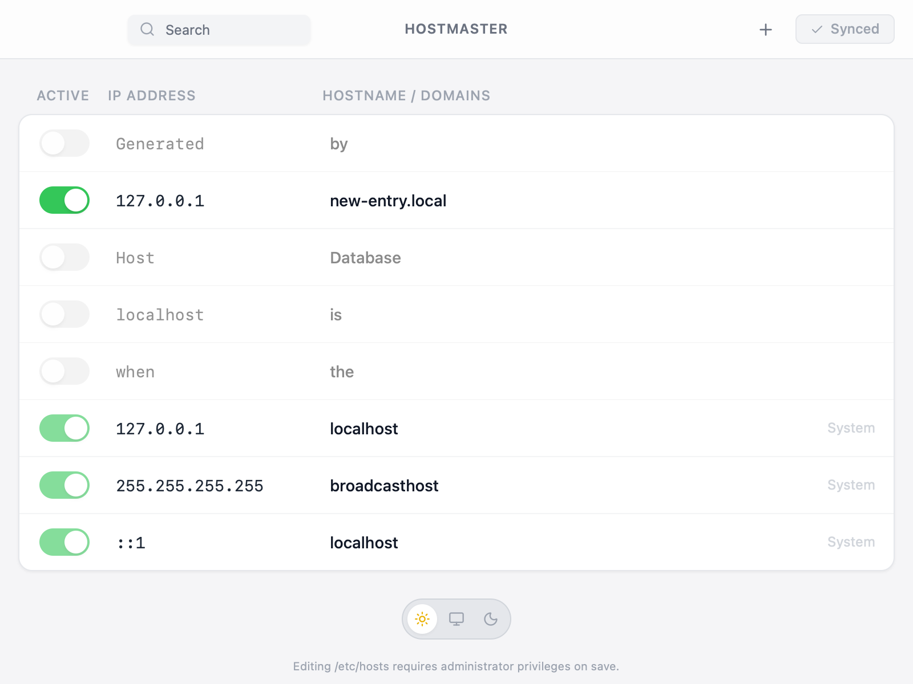
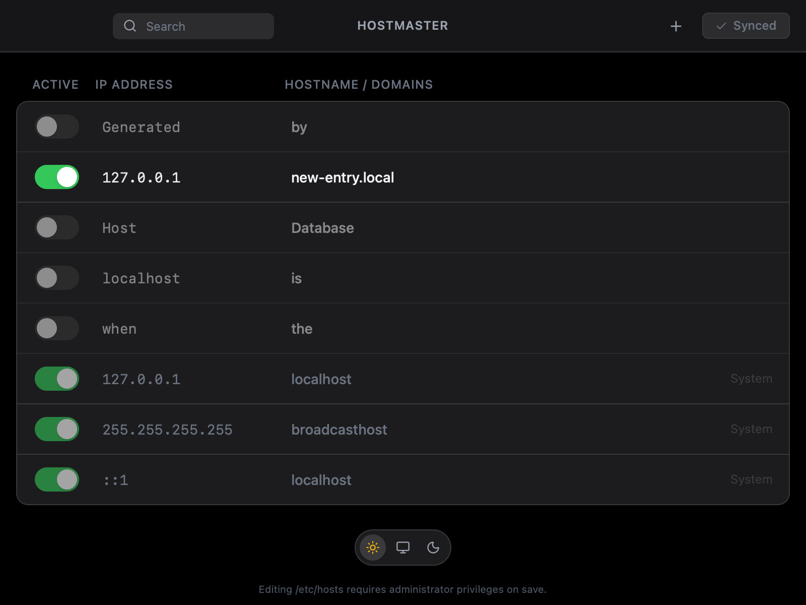

<div align="center">
  

  # HostMaster

  **The modern, native `/etc/hosts` manager for macOS, Linux, and Windows.**

  [](https://opensource.org/licenses/MIT)
  [](https://v2.tauri.app/)
  [](https://www.rust-lang.org/)
  [](https://react.dev/)

  <p align="center">
    <a href="#-download">Download</a> •
    <a href="#-features">Features</a> •
    <a href="#-getting-started">Getting Started</a>
  </p>
</div>

---

**HostMaster** reimagines how you manage your system's host entries. Built with **Tauri v2**, it combines the performance and security of **Rust** with a beautiful, Apple-native **React** interface.

## 📸 Screenshots

<div align="center">
  
  &nbsp;
  
</div>

## ✨ Features

*   **🎨 Modern "Liquid" Design:** A premium, native-feeling UI with smooth animations, blur effects, and Apple-standard aesthetics.
*   **🌗 Adaptive Theming:**
    *   **True Black Dark Mode:** Optimized for OLED displays.
    *   **System Sync:** Automatically adapts to your OS theme preference.
    *   **Native Window:** The title bar and window controls blend perfectly with the app content.
*   **⚡️ Fast & Efficient:**
    *   **Instant Toggles:** Enable or disable host entries with a single click.
    *   **Inline Editing:** Edit IP addresses and domains directly in the list.
    *   **Smart Search:** Filter through hundreds of entries instantly.
*   **🔒 Secure by Design:**
    *   **Read-Only by Default:** Reads your hosts file safely on startup.
    *   **Privileged Saves:** Only requests Administrator/Sudo permissions (`osascript` on macOS, `pkexec` on Linux) when you explicitly save changes.
    *   **Atomic Writes:** Writes to a temporary file first to prevent corruption.

## 📥 Download

Get the latest version for your operating system from the **[Releases Page](https://github.com/theabhayprajapati/hostmaster/releases)**.

### macOS
1. Download the `.dmg` file from the [Releases](https://github.com/theabhayprajapati/hostmaster/releases) page.
2. Open the `.dmg` and drag the app to your Applications folder.
3. **Important:** If you see a message saying the app is "damaged" or "cannot be opened", run this command in your terminal:
   ```bash
   xattr -cr /Applications/HostMaster.app
   ```
   *(This is required because the app is not yet notarized by Apple)*

| Platform | Format |
| :--- | :--- |
| **macOS** | `.dmg` (Universal) |
| **Linux** | `.deb`, `.AppImage` |
| **Windows** | `.exe` |

## 🛠️ Tech Stack

*   **Core:** [Tauri v2](https://v2.tauri.app/) (Rust + Webview)
*   **Frontend:** React 19, TypeScript, Vite
*   **Styling:** Tailwind CSS v3, Lucide Icons
*   **State Management:** React Hooks

## 🚀 Getting Started

### Prerequisites

*   [Node.js](https://nodejs.org/) (v18+)
*   [Rust](https://www.rust-lang.org/tools/install) (latest stable)

### Installation

1.  **Clone the repository:**
    ```bash
    git clone https://github.com/theabhayprajapati/hostmaster.git
    cd hostmaster
    ```

2.  **Install dependencies:**
    ```bash
    npm install
    ```

3.  **Run in Development Mode:**
    ```bash
    npm run tauri dev
    ```

### Building for Production

To create a standalone installer for your OS:

```bash
npm run tauri build
```
The output will be in `src-tauri/target/release/bundle`.

## 📄 License

This project is open source and available under the [MIT License](LICENSE).
